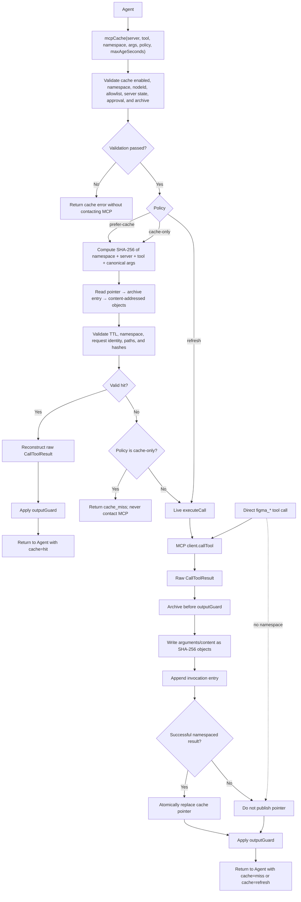

# MCP Result Archive and Read-through Cache Plan

## Status

- Raw result archive: implemented behind `settings.resultArchive`
- Explicit read-through tool: implemented as `mcpCache` behind `settings.resultCache`
- Figma agent guidance: bundled as `figma-mcp-cache`
- Transparent interception of direct MCP tools: intentionally not implemented
- Windows private ACL support: not implemented; raw archiving fails closed

## Problem

Large MCP responses may be truncated before they reach the model or session history. Repeated Figma reads also consume daily and per-minute quotas even when the same node and arguments were fetched recently.

The design separates two concerns:

1. **Archive:** preserve the raw `CallToolResult` before output guarding.
2. **Read-through cache:** reuse an explicitly namespaced successful archive entry without contacting the MCP server.

This separation prevents an old or cross-document result from silently replacing a live call.

## Goals

- Preserve complete raw MCP results before model-facing truncation.
- Deduplicate repeated text, image, argument, and structured payloads.
- Avoid a live MCP call on a validated namespaced cache hit.
- Make stale-evidence behavior explicit through policy and TTL.
- Never publish MCP errors or oversized omitted results as hits.
- Preserve server-disabled and approval enforcement on cache hits.
- Keep archive failures non-fatal to the underlying MCP call.

## Non-goals

- Automatically cache dynamic current-selection requests.
- Infer a Figma file identity from `nodeId` alone.
- Claim that cached evidence represents the latest design.
- Cache write/mutation tools.
- Bypass MCP server permissions or approval policy.

## Configuration

Both features are disabled by default. Read-through caching requires the backing archive to be enabled for the same server.

```json
{
  "settings": {
    "resultArchive": {
      "enabled": true,
      "directory": "~/Library/Application Support/pi-mcp-adapter/archive",
      "servers": ["figma-desktop", "figma"],
      "maxBytes": 52428800,
      "maxArgumentBytes": 1048576
    },
    "resultCache": {
      "enabled": true,
      "allowTools": [
        "figma-desktop/get_design_context",
        "figma-desktop/get_metadata",
        "figma-desktop/get_screenshot",
        "figma-desktop/get_variable_defs"
      ],
      "defaultMaxAgeSeconds": 3600,
      "requireNodeId": true
    }
  }
}
```

Environment overrides:

- `MCP_RESULT_ARCHIVE=0|1`
- `MCP_RESULT_ARCHIVE_DIR=/path`

Per-server `resultArchive: true | false` overrides global archive enablement.

## Storage layout

```text
archive/
├── entries/<server>/<date>/*.json
├── objects/<sha-prefix>/<sha256>
└── cache/<cache-key-prefix>/<cache-key>.json
```

- `entries`: append-only invocation metadata and object references
- `objects`: SHA-256 content-addressed arguments, text, decoded images, `_meta`, structured content, and extra fields
- `cache`: atomic pointers from a namespaced canonical request key to the latest reusable successful entry

macOS/Linux directories use mode `0700`; files use `0600`. Existing unsafe directories are rejected rather than silently chmodded. Windows is currently unsupported because private ACL provisioning is not implemented.

## Cache identity

```text
SHA-256(
  namespace
  + server
  + original tool name
  + canonical JSON arguments
)
```

For Figma URLs:

- `/design/<fileKey>/...?...node-id=123-456` → namespace `<fileKey>`, node ID `123:456`
- `/design/<fileKey>/branch/<branchKey>/...` → namespace `<branchKey>`

A namespace and explicit `nodeId` are required by default. Direct `figma_*` calls have no namespace, so their results can be archived but do not create reusable pointers.

## Read-through call chain



| Stage | Cache hit | Cache miss / `refresh` | Direct `figma_*` call |
|---|---|---|---|
| Namespace required | Yes | Yes | No |
| Approval and server-disabled checks | Yes | Yes | Yes |
| Contacts MCP server | No | Yes | Yes |
| Archives raw result before truncation | No new entry | Yes | Yes |
| Publishes reusable pointer | Already exists | Successful namespaced results only | No namespace, so no pointer |
| Applies `outputGuard` | Yes | Yes | Yes |
| MCP error becomes a hit | Never | Never | Never |

## Tool usage

```js
mcpCache({
  server: "figma-desktop",
  tool: "get_design_context",
  namespace: "your-figma-file-key",
  args: {
    nodeId: "123:456",
    clientLanguages: "dart",
    clientFrameworks: "flutter"
  },
  policy: "prefer-cache",
  maxAgeSeconds: 3600
})
```

Only exact `server/original-tool` entries in `allowTools` can run.

## Policies and freshness

| Use case | Policy | Contacts MCP server | May return older data | Suggested age window | Proves current state |
|---|---|---:|---:|---:|---:|
| Check whether a design/spec changed | `refresh` | Yes | No | N/A | Yes, if live evidence succeeds |
| Formal drift verification | `refresh` | Yes | No | N/A | Yes, if all required evidence succeeds |
| Ordinary repeated work | `prefer-cache` | On miss/expiry | Yes | 3,600 seconds | No |
| Rate-limit evidence fallback | `cache-only` | No | Yes | 86,400 seconds | No |
| Offline evidence review | `cache-only` | No | Yes | Explicit caller choice | No |
| Force pointer replacement | `refresh` | Yes | No | N/A | Yes, if live evidence succeeds |
| Active tab unconfirmed | Do not call | No | No data used | N/A | No |
| Missing namespace or `nodeId` | Do not use cache | Depends on explicit live workflow | Unsafe to determine | N/A | No |
| MCP error | No pointer | Yes for attempted live call | Error is never a hit | N/A | No |

| Policy | Reads cache first | Live call on miss | Replaces pointer | Suitable during rate limiting |
|---|---:|---:|---:|---:|
| `prefer-cache` | Yes | Yes | On successful miss | No; a miss contacts the limited server |
| `cache-only` | Yes | Never | No | Yes |
| `refresh` | No | Always | On successful live call | No |

## Evidence status guidance

| Evidence source | Safe claim | Do not claim |
|---|---|---|
| Successful `refresh` with all required context/screenshots | Current evidence was verified | Anything beyond returned evidence |
| Successful `refresh` with missing required evidence | Partial/unverifiable | Full verification completed |
| `prefer-cache` hit | Cached evidence matches the inspected reference | Current Figma has not changed |
| `cache-only` hit | Historical evidence is available; report age/source | This is the latest design |
| `cache-only` miss | No reusable namespaced cache exists | Guessed design content |
| Rate-limit response | Blocked/unverifiable; use `cache-only` without direct retries | Repeated reset probes |
| Node absent from active tab | Active-file mismatch | Rate limiting |

`cache-only` during a quota lockout is deliberately stale-evidence mode. It must not upgrade verification status by itself.

## Integrity and safety

A hit is accepted only after validating:

- pointer schema, namespace, server, tool, and timestamp
- referenced entry schema and cache key
- canonical request argument identity
- TTL
- real-path containment under the configured archive root
- regular-file/no-symlink requirements
- SHA-256 object hashes
- server disabled state and approval policy

MCP error results, oversized omitted results, and oversized omitted arguments never publish cache pointers.

## Agent behavior

The bundled `figma-mcp-cache` skill instructs new agents to:

- prefer `mcpCache` for link-based Figma reads
- extract file/branch identity from the URL
- use `refresh` for “check whether it changed”
- use `cache-only` with a deliberate 86,400-second window after rate limiting
- stop direct Figma retries during a quota lockout
- distinguish cached evidence from current live verification

## Rollout plan

### Phase 1 — Archive

- Capture raw results before `outputGuard`.
- Store content-addressed objects and append-only entries.
- Keep tool behavior unchanged.

### Phase 2 — Explicit read-through cache

- Add `mcpCache` with stable namespaces.
- Support `prefer-cache`, `cache-only`, and `refresh`.
- Require exact allowlists and explicit node identity.

### Phase 3 — Migration and promotion

- Import historical Pi session results.
- Promote only entries with a verified file/branch namespace.
- Reject errors, incomplete/truncated data, and ambiguous file identity.
- Record provenance and original capture time.

### Phase 4 — Operations

- Add cache inventory, hit/miss counters, invalidation, and pruning commands.
- Report saved MCP calls and storage usage.
- Add retention policies without deleting unique evidence unexpectedly.

## Open questions

- Should cache pointers support Figma revision/last-modified data if the server exposes it later?
- Should successful direct archive entries be promotable through a reviewed CLI command?
- What retention policy should apply to append-only invocation entries?
- Should Windows support provision private ACLs or keep failing closed?
- Should approval be recorded separately for cache hits versus live calls?
